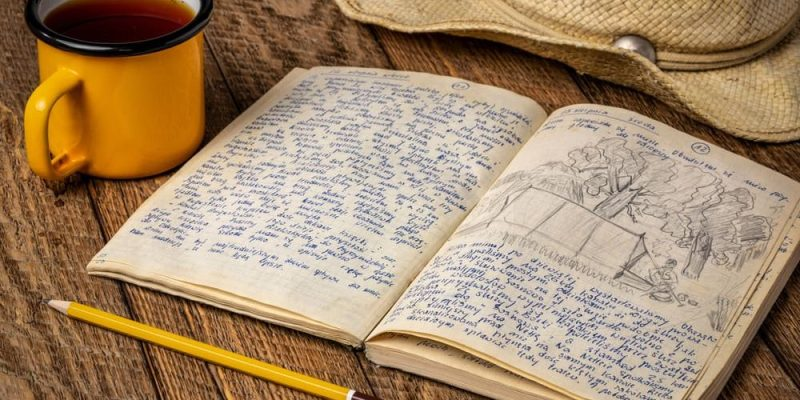

# Cuaderno de Bitácora

## Día uno
Se creó una instancia

## Día dos
Se creó una imagen y se enlazó a este documento:

	
## Día 3
Se recibe para hacer un commit

### Día 4
Estudiamos los camoandos

Edito este archivo para el repo de Sergio

Y estos son otros cambios!!

## Enlazo otra foto:

